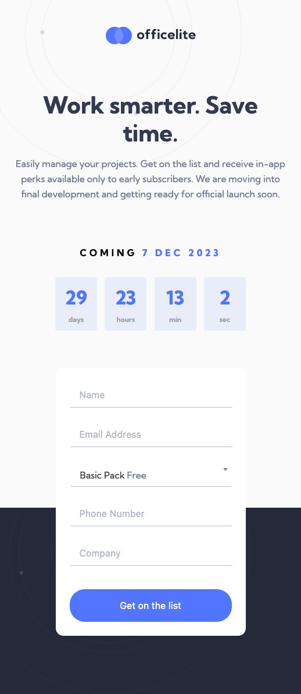
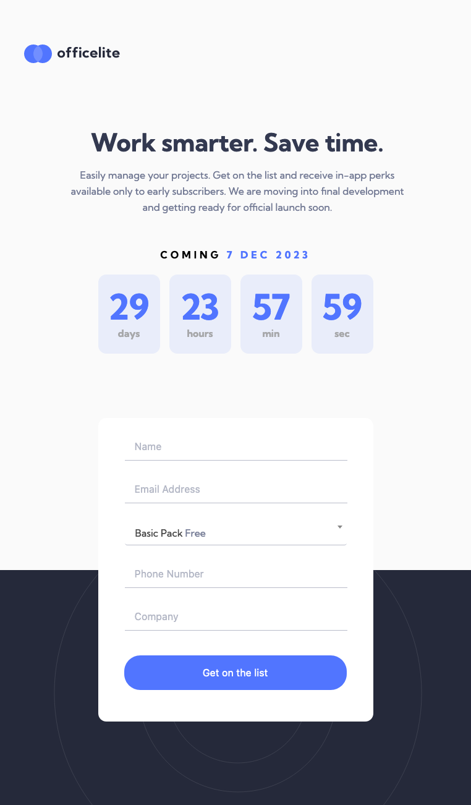

# Frontend Mentor - Officelite coming soon site solution

This is a solution to the [Officelite coming soon site challenge on Frontend Mentor](https://www.frontendmentor.io/challenges/officelite-coming-soon-site-M4DIPNz8g). Frontend Mentor challenges help you improve your coding skills by building realistic projects. 

## Table of contents

- [Overview](#overview)
  - [The challenge](#the-challenge)
  - [Screenshot](#screenshot)
  - [Links](#links)
  - [Built with](#built-with)
  - [What I learned](#what-i-learned)
  - [Continued development](#continued-development)
  - [Useful resources](#useful-resources)
- [Author](#author)

## Overview
For this challenge, I needed to reproduce a two-page website from a Figma design. The design had a mobile, tablet, and desktop layout with links on the homepage to the sign-up page. The sign-up page has a form that verifies the information the user inputs. Also, each page has a countdown clock for the release of the project.  If the user has visited the site before, the stored date will display for them. If it is their first time to the site, the clock will be set to 30 days into the future from original page load. The clock will count down from this future date. When the clock reaches 0, it will reload to another 30 days out into the future. This is for display purposes. 

### The challenge

Users should be able to:

- View the optimal layout for the site depending on their device's screen size
- See hover states for all interactive elements on the page
- See error states when the contact form is submitted if:
  - The `Name` and/or `Email Address` fields are empty
  - The `Email Address` is not formatted correctly
- **Bonus**: See a live countdown timer that ticks down every second
- **Bonus**: See a custom-styled `select` form control in the sign-up form

### Screenshot






### Links

- Solution URL: [Add solution URL here](https://github.com/Stacy-Riley/officelite-coming-soon-site)
- Live Site URL: (https://stacy-riley.github.io/officelite-coming-soon-site/)

### Built with
- Semantic HTML5 markup
- CSS
- Flexbox
- Mobile-first workflow
- Vanilla JavaScript

### What I learned 
-Learned that you can nest a span inside of a span
-For the pages, it wasn't a good idea to use the same classes for the time elements as they were styled differently on the two pages. Going forward, I will think more in depth about the implementation before beginning future projects.
-Worked with negative margins in footer w/ z index to have it placed behind the cards
-JS, I used the browser's localstorage to store the countdown clock and reference it when the client returns to the site

```css
/* This code is to allow for footer background color to extend
up behind this section of code */
.main-homepage {
  position: relative;
  z-index: 1;
}

/* This portion brings the background-color behind the "main-homepage" element */
.countdown-section {
  position: relative;
  z-index: 0;
  margin-top: -800px;
}
```
```js
//Check if user has already visited site and has a futureDate stored in localStorage
let storedDateTime = localStorage.getItem('futureDateTime');
```

### Continued development

In my future projects, I aim to further explore the functionalities related to dates and countdown clocks. Integrating these features not only enhances the visual appeal of a website but also offers practical applications, especially for site owners interested in time-sensitive events like sales, promotions, or limited-time offers.

I see immense potential in utilizing countdown clocks to create a sense of urgency, encouraging user engagement, and boosting conversion rates. Being able to dynamically display time remaining for special events can significantly impact user experience and customer satisfaction. I am enthusiastic about honing my skills in this area and providing this valuable feature to my clients. This will not only elevate the aesthetics of the websites I build but also contribute to their overall effectiveness in achieving specific business goals.

### Useful resources

- [Example resource 1](https://css-tricks.com/how-to-create-an-animated-countdown-timer-with-html-css-and-javascript/) - This helped me learn about integrating the countdown timer onto my website.
- [Example resource 2](https://developer.mozilla.org/en-US/docs/Web/API/Web_Storage_API) - This is where I learned about localstorage in the browser.

## Author

- Website - [Stacy Riley](https://www.createdbystacy.com)
- Frontend Mentor - [@Stacy-Riley](https://www.frontendmentor.io/profile/Stacy-Riley)
- Twitter - [@askstacyriley](https://twitter.com/AskStacyRiley)
